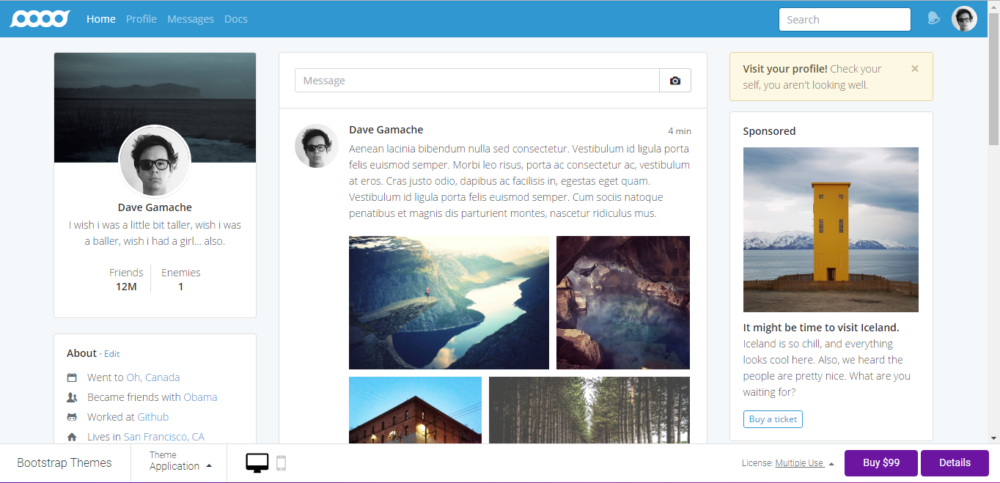
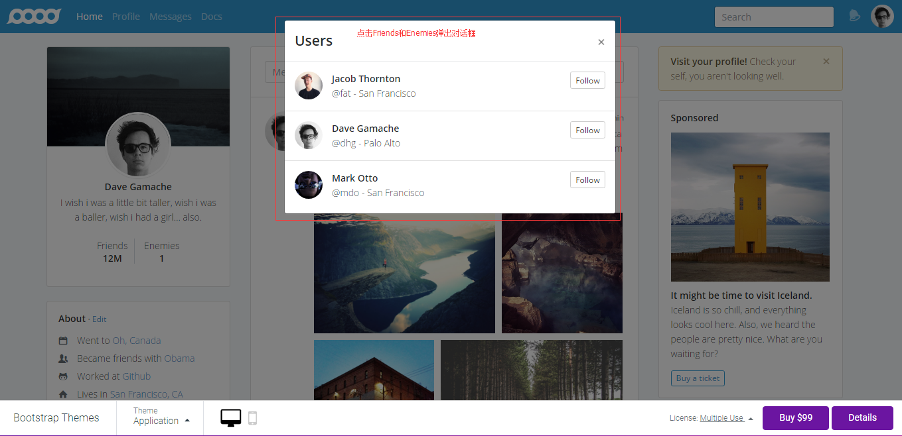

#拓胜科技前端工程师笔试试题

    <h3>以下试题根据自己的应聘职位的等级自行选择一题作答即可。</h3>
    <ul>
	    <li>
任务1（初级）：用纯css/div实现下图的效果。
</li>
	    
            <li>
任务2（初、中级）：使用标准css或者Bootstrap等框架实现下图的效果。
</li>
	    
	    <li>
任务3（中级）：实现天猫首页的布局（支持PC和移动设备，做到响应式布局），材料自己从天猫网站下载，不要抄袭原站代码。
</li>
	    
	     <li>
任务4（中、高级）：内容同任务3，进一步要求如下
</li>
	     1、网页中数据使用vue、angular2、react中任选一个MVVM框架加载，数据自己模拟，如果会使用mock技术加分。 
	     2、如果将数据存放到服务器端，REST发布服务，在代码中说明vue、angular2、react如何解决跨域访问问题（加分）。 
	     3、如果将数据存放到服务器端，REST发布服务，如果客户与服务器端要保留cookie通信，在代码中说明vue、angular2、react如何处理（加分）。 
	    <li>
任务5（中级）：实现<a href="https://themes.getbootstrap.com/products/application">样板网站</a>的布局（支持PC和移动设备，做到响应式布局），材料自己下载，不要抄袭原站代码。
</li>
	      
	       
	    <li>
任务6（中、高级）：内容同任务5，进一步要求如下
</li>
	     1、网页中数据使用vue、angular2、react中任选一个MVVM框架加载，数据自己模拟，如果会使用mock技术加分。 
	     2、如果将数据存放到服务器端，REST发布服务，在代码中说明vue、angular2、react如何解决跨域访问问题（加分）。 
	     3、如果将数据存放到服务器端，REST发布服务，如果客户与服务器端要保留cookie通信，在代码中说明vue、angular2、react如何处理（加分）。 
	     
   </ul>

