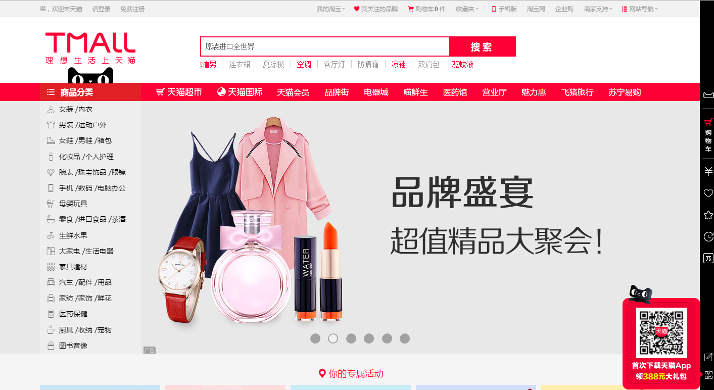

#拓胜科技前端工程师笔试试题

    <h3>以下试题根据自己的应聘职位的等级自行选择一题作答即可。</h3>
    <ul>
	    <li>
任务1（初级）：用纯css/div实现下图的效果。
</li>
	    
            <li>
任务2（中级）：使用标准css或者Bootstrap等框架实现下图的效果。
</li>
	    
	    <li>
任务3（中级）：实现天猫首页的布局（支持PC和移动设备，做到响应式布局），材料自己从天猫网站下载。
</li>
	    
    </ul>

